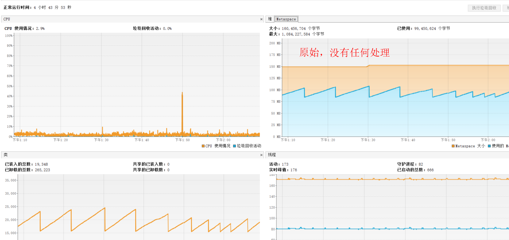
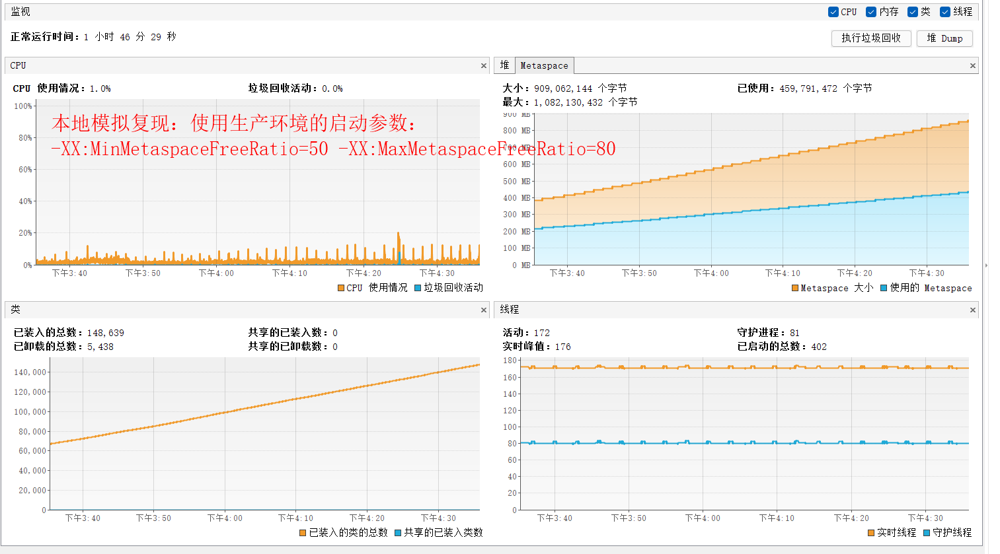
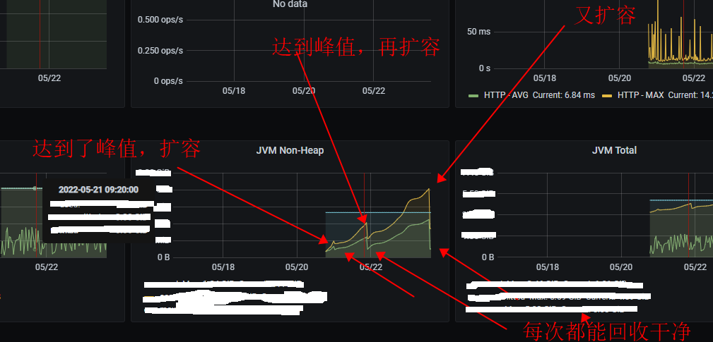
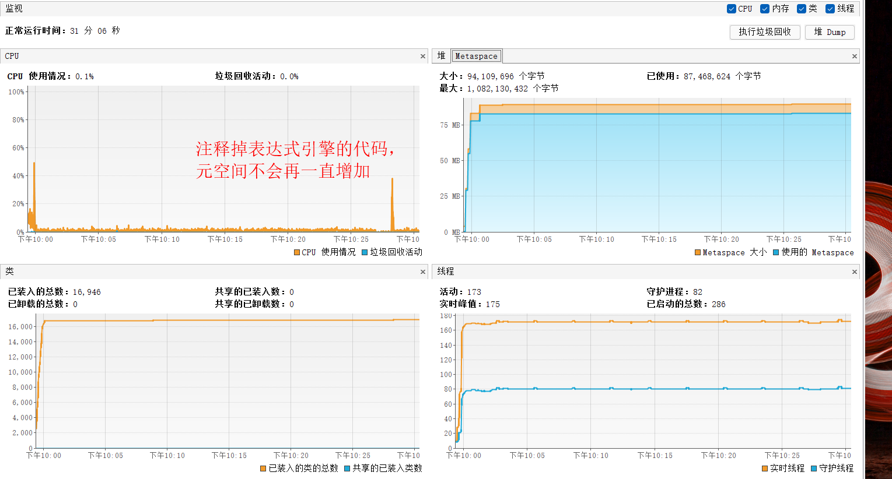

## 记一次 non-heap 的内存溢出

## 前言

内存溢出 --> 内存泄漏。内存溢出，第一反应是不是哪里出现了内存泄漏，这是一个习惯性反应。

然而这一次不是，而且还是我第一次遇到 non-heap 内存溢出（以前遇到的都是堆的内存溢出）

## 背景

最近经常收到运维反馈，新工程内存报警。去监控平台看，推内存并无问题，而是非堆（non-heap）内存一直在增加

## 结论

内存溢出，刚开始习惯性的以为内存泄漏导致的，后面证实是错的。
表达式引擎不停往元空间产生对象，而元空间每次FGC之后会扩容，且无限扩容，导致内存空间不够。

1. 启动参数指定了-XX:MinMetaspaceFreeRatio=50 -XX:MaxMetaspaceFreeRatio=80
   意义：为了防止频繁FGC，非堆空间满了，FGC之后会进行扩容，但是由于没有指定-XX:MaxMetaspaceSize，导致元空间无限扩容
2. 表达式引擎会将一些字符串放入运行时常量池，导致元空间一直在增加
3. 由上面总结：元空间一直在增加，一次FGC之后，内存扩大，第二次FGC之后，内存再次扩大......    如此反复，内存占用太高。

## 解决方案

1. 指定-XX:MaxMetaspaceSize， 可扩容的最大元空间。

## 排除过程

1. 本地验证，无法复现，每次元空间增长之后，都会及时被回收
   

2. 向运维拿启动参数，用他们的启动参数启动，就可以复现出来（non-heap一直增长）
   

3. 回顾生产环境，每次FGC之后都能将内存回收干净，且下一次的GC阈值又扩大了。
   **也就是说每次垃圾回收都能回收干净，并不存在内存泄漏,** 只是由于阈值一直在扩大，无法触发FGC
   

   

   *综上所示，是由于non-heap每次FGC之后都会扩容，且无限扩容导致的问题。
   但是有两个问题无法解释：*

   1. 是元空间一般不会一直增长啊？ 

   2. 为什么其他项目不会有问题？

      分析代码发现是：表达式引擎会往元空间放运行时常量池*

4. 注释掉表达式引擎时，元空间不会增长
   

5. 有表达式引擎时，元空间会一直增长
   

6. 指定XX:MaxMetaspaceSize=110m之后
   

## 参考：

[《JDK8 的FullGC 之 metaspace》](https://www.jianshu.com/p/1a0b4bf8d498)
[《jdk8Metaspace调优》](https://wenku.baidu.com/view/9ce9323cb4360b4c2e3f5727a5e9856a56122611.html)

##  **jdk8Metaspace调优**

从JDK8开始，永久代(PermGen)的概念被废弃掉了，取⽽代之的是⼀个称为Metaspace的存储空间。Metaspace使⽤的是本地内存，⽽

不是堆内存，也就是说在默认情况下Metaspace的⼤⼩只与本地内存⼤⼩有关。当然你也可以通过以下的⼏个参数对Metaspace进⾏控

制：

1. -XX:MetaspaceSize=N 

   这个参数是初始化的Metaspace⼤⼩，该值越⼤触发Metaspace GC的时机就越晚。随着GC的到来，虚拟机会根据实际情况调控

   Metaspace的⼤⼩，可能增加上线也可能降低。在默认情况下，这个值⼤⼩根据不同的平台在12M到20M浮动。使⽤java -

   XX:+PrintFlagsInitial命令查看本机的初始化参数，-XX:Metaspacesize为21810376B（⼤约20.8M）。

2. -XX:MaxMetaspaceSize=N 

   这个参数⽤于限制Metaspace增长的上限，防⽌因为某些情况导致Metaspace⽆限的使⽤本地内存，影响到其他程序。在本机上该参

   数的默认值为4294967295B（⼤约4096MB）。

3. -XX:MinMetaspaceFreeRatio=N 

   当进⾏过Metaspace GC之后，会计算当前Metaspace的空闲空间⽐，如果空闲⽐⼩于这个参数，那么虚拟机将增长Metaspace的⼤

   ⼩。在本机该参数的默认值为40，也就是40%。设置该参数可以控制Metaspace的增长的速度，太⼩的值会导致Metaspace增长的

   缓慢，Metaspace的使⽤逐渐趋于饱和，可能会影响之后类的加载。⽽太⼤的值会导致Metaspace增长的过快，浪费内存。

4. -XX:MaxMetasaceFreeRatio=N 

   当进⾏过Metaspace GC之后， 会计算当前Metaspace的空闲空间⽐，如果空闲⽐⼤于这个参数，那么虚拟机会释放Metaspace的

   部分空间。在本机该参数的默认值为70，也就是70%。

5. -XX:MaxMetaspaceExpansion=N 
   Metaspace增长时的最⼤幅度。在本机上该参数的默认值为5452592B（⼤约为5MB）。

6. -XX:MinMetaspaceExpansion=N 
   Metaspace增长时的最⼩幅度。在本机上该参数的默认值为340784B（⼤约330KB为）。

   

